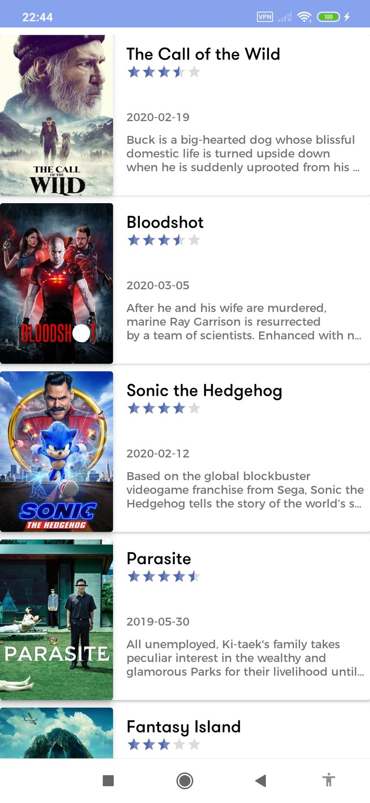

# Themoviedb

This repository contains a detailed sample app that implements MVVM architecture using Dagger2, Room, RxJava2, Navigation, Paging and lifecycle for
show themoviedb database movies

# Demo
 <pre>
    
</pre>

  

# Libraries Used

<dl>
  <dt>Patterns and frameworks</dt>
  <dd>- MVVM (Model-View-ViewModel) using Google's new Architecture components ViewModel, LiveData, LifecycleObserver, etc.</dd>
  <dd>- Recommended app architecture in https://developer.android.com/jetpack/docs/guide</dd>
  
  <dt>Remote Call APIs</dt>
  <dd>- Retrofit 2 to perform HTTP requests.</dd>
  
  <dt>Dependency Injection</dt>
  <dd>- Dagger Android 2.22.1 to manage App and Activity-scoped dependencies. </dd>
    
  <dt>Communication between app layer</dt>
  <dd>- RxJava2 and RxAndroid for interacting between ViewModel and rest calls. </dd>
  <dd>- livedData for interacting between view and ViewModel and repositories.  </dd>
    
  <dt>other</dt>
  <dd>- AndroidX </dd>
  <dd>- Navigation </dd>
</dl>

# Dependency Rule:
1.	data:
2.	domain:
3.  presentation:
4.	common:
5.	common_text:

## Overview
     consider the following diagram, which shows how all the  modules  interact with one 
     
     another after designing the app:
     
     

